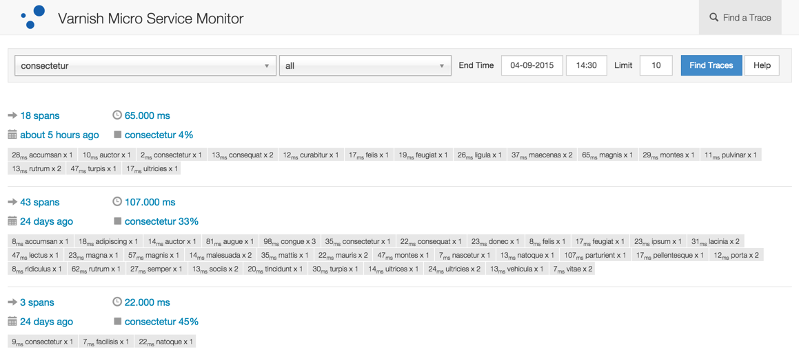
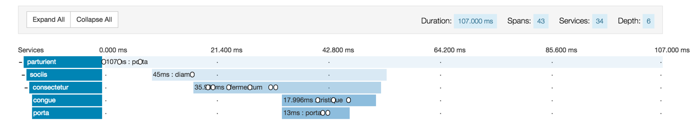
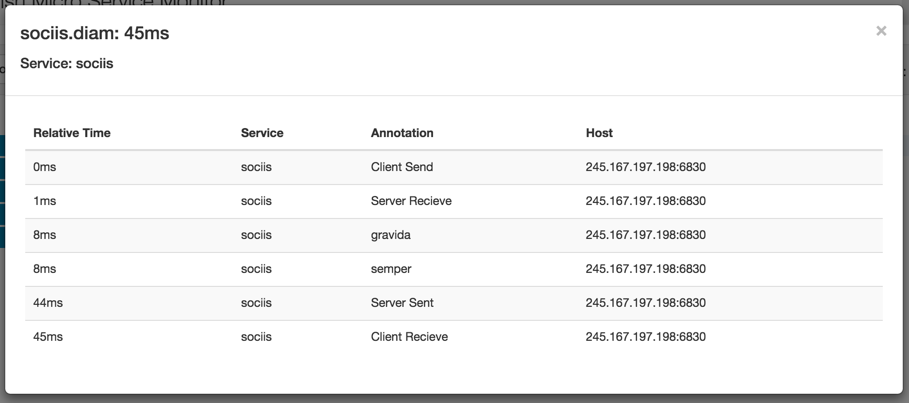
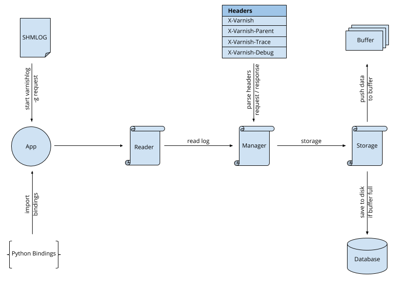

#### Demo Environment ####

You need to have [Vagrant](https://www.vagrantup.com/) and [Ansible](http://www.ansible.com/) already installed.

```
$> git clone https://github.com/varnish/zipnish.git

$> cd zipnish/provisioning

$> vagrant up

$> ansible-playbook main.yml
```

Once the above task finish you would be able to see the user interface on: [http://192.168.75.11:9000/](http://192.168.75.11:9000/)

#### Presentation ####
[Varnish Microservices 2.0](http://www.slideshare.net/Varnish_software/microservices-20)

#### Screenshots ####

Lookup


Search Results


Annotations


#### System Level View ####

A system level view of how everything comes together.



#### User Interface ####

User interface will use the UI files (styles, scripts and templates) from ZipKin.

[Link to UI](ui/)

#### Code Documentation ####

* [Varnish API](docs/code/Varnish API.md)
* [Headers](docs/code/Headers.md)
* [Reader](docs/code/Reader.md)
* [Data Manager](docs/code/Data Manager.md)
* [Buffer](docs/code/Buffer.md)
* [Storage](docs/code/Storage.md)

#### Next Steps ####

1. Mimic data flow with parent headers etc. just as ZipKin uses inside you application.
2. Make the application function as close to ZipKin as possible.
3. Use ZipKin user-interface to display information.
4. Document functionality implemented. The flow of the system.

#### How to track ####

1. If X-VARNISH-TRACE header is present use X-VARNISH-TRACE header, otherwise assign X-VARNISH header value to X-VARNISH-TRACE
2. Assign X-VARNISH header value to X-VARNISH-PARENT
3. Send X-VARNISH-TRACE and X-VARNISH-PARENT headers to any child request.
