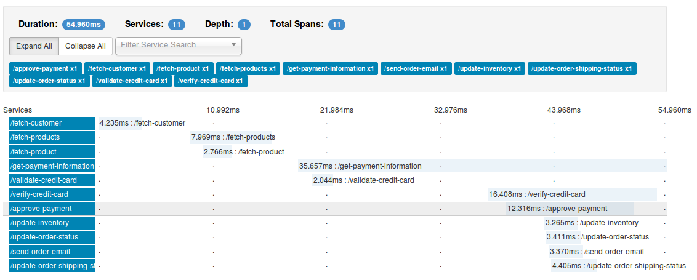

## Services Logging Result ##

Below shows an expanded overview of services calls in call chain.

## Next Steps ##

1. Mimic data flow with parent headers etc. just as zip kin uses inside you application.
2. Make the application function as close to ZipKin as possible.
3. Copy the ZipKin user-interface folder and try to use the user interface of ZipKin to display your data. That way no work has to be performed on the frontend UI part. 
4. This way we will also be able to re-use any opensource UI updates that happen inside ZipKin.
5. Document functionality implemented. The flow of the system.

## Tracking Micro-Services via Varnish Cache ##

Running ``./script.sh`` should start a web-server on port 8080

Track timing of micro-service requests by passing micro-service requests through a varnish server.

Varnish Cache would run on port **6081** by default. The default.vcl file connects to port **9000** for backend requests. Modify default.vcl file to ``return (pass);`` from vcl_recv sub routine.

* [Configuring JDK](docs/Configuring JDK.md)
* [ZipKin](docs/ZipKin.md)
* [Creating Services](docs/RPC Services.md)
  * [Example Service](docs/Example Service.md)
    * [Bash Script](script.sh)
     * be sure to change chmod +x script.sh, so you can run it as ``$> ./script.sh``
* [Structure of ZipKin tables and generating false data](docs/False data.md)
* [ZipKin and Varnishlog headers](docs/ZipKin and Varnishlog headers.md)
* [Varnish Logger](docs/Varnish Logger.md)

#### Machine Used ####

Debian 8.1 / **specifically** Linux debian 3.16.0-4-amd64 #1 SMP Debian 3.16.7-ckt9-3~deb8u1 (2015-04-24) x86_64 GNU/Linux
